# Workflow Showcase

**한국어** · [English](./README.md)

> `Workflow Showcase template`은 프리미어에서 뽑은 XML 데이터를 기반으로 최종 렌더링된 영상 밑에 간단한 워크플로우를 얹어주는 단순한 템플릿 앱입니다.

**목차**: [AI 커스터마이징](#ai-에이전트로-수정하기) · [미리보기](#미리보기) · [설치 방법](#설치-방법) · [사용 방법](#사용-방법) · [입력값 설정](#입력값-설정) · [레퍼런스 세팅](#레퍼런스-세팅하는-방법) · [문제 해결](#문제-해결) · [마치며](#마치며)

## AI 에이전트로 수정하기

이 저장소를 Codex·Claude 같은 코딩 에이전트에게 맡길 때는 코드를 바로 뒤지게 하지 말고 다음 문서부터 읽게 하세요.

- [에이전트 안전 지침](./AGENTS.md)
- [AI 커스터마이징 안내](./docs/CUSTOMIZING_WITH_AI.ko.md)
- [프로젝트와 계약 지도](./docs/PROJECT_MAP.md)

Stable core나 Red Zone을 건드리는 요청은 수정 전에 먼저 보고해야 합니다. 규칙을 프롬프트에 다시 옮겨 적기보다 위 문서를 최신 기준으로 사용하세요.

# 미리보기

## 데모 영상

[](https://youtu.be/PEgAahhQ0S8?si=GPWo128m4cGhtP9S)

▶ **유튜브에서 데모 영상 보기**

앱의 기본 구동은 이렇습니다.

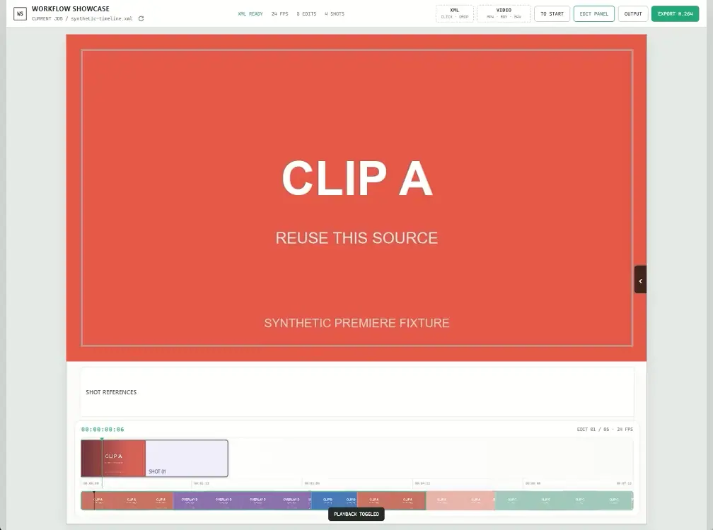

화면 중앙에 CLIP A로 보이는 게 실제 사용자의 최종 작업물입니다.

하단에는 자신이 생성에 사용한 레퍼런스와 편집 툴에서 작업한 내용이 그대로 연결됩니다.

---

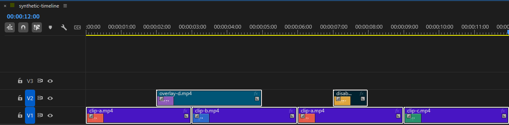

기본값은 `활성화된 클립` 중 **가장 위에 있는 (PRIMARY) 클립**만 가져옵니다.


취향에 따라 이런 식으로도 출력 가능합니다. 에이전트한테 자유롭게 바꿔 달라고 하세요.

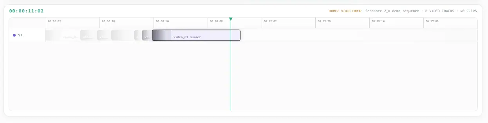

---

제작하면서 사용한 샘플로 예시를 보여드리면 이런 느낌입니다.

레퍼런스/클립 부분의 인터랙션 변화만 봐주세요.

최종 샷의 개수는 사용자가 사용한 원본 영상 클립 개수와 동일합니다. 샷별로 컷을 쪼갠 건 역시 한 샷으로 취급되고 컷 개수는 타임라인 우측 상단에 작게 EDIT으로 표시됩니다.

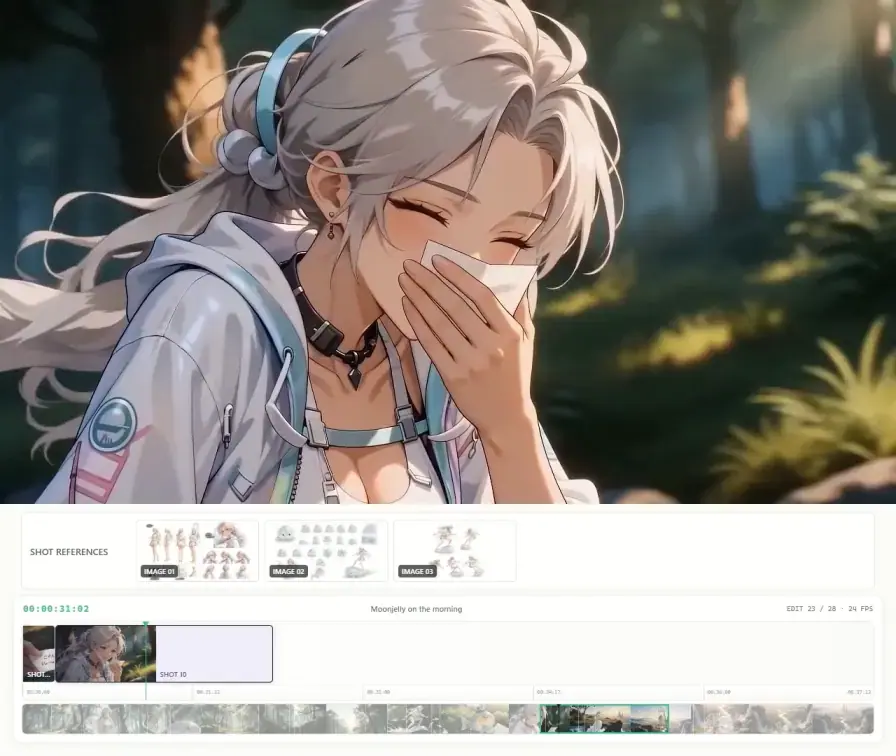

---

# 설치 방법

제일 쉬운 방법: CODEX나 Claude 같은 에이전트한테 아래 URL 던지고 설치해 달라고 하세요.

```
https://github.com/ch5p/workflow-showcase
```

직접 하실 거면 요구사항은 이렇습니다.

- Windows 10 / 11
- Node.js 22.12 이상
- FFmpeg (Export할 때만 필요)
- NVIDIA GPU 권장 (없으면 CPU로 폴백)

```
git clone https://github.com/ch5p/workflow-showcase
cd workflow-showcase

winget install -e --id Gyan.FFmpeg

npm.cmd ci
npm.cmd start
```

다음부터는 폴더 안의 `START_APP.cmd` 더블클릭으로 켜면 됩니다.

처음 켜면 샘플 Job을 재생할 수 있고, 본인 XML을 넣고 교체하시면 됩니다.

앱 언어는 Windows 언어를 따라 한국어/영어로 뜨고, 상단 `EN/KR` 버튼으로 바꿀 수 있습니다.

---

# 사용 방법

프로그램 사용법은 이러합니다.

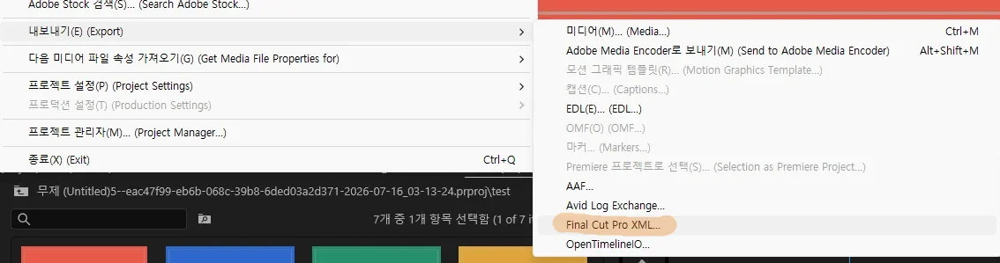

## 1. 프리미어에서 내보내기 > Final Cut Pro XML...로 XML 파일 출력하세요.

- WS는 Adjustment Layer 같은 효과 레이어를 현재 지원하지 않으며 XML을 불러올 때 자동으로 제외합니다. 기본 UI에는 실제 영상 클립만 표시됩니다. 효과 레이어를 `FX`처럼 노출하려면 별도의 입력 어댑터와 UI를 추가해야 합니다.

## 2. 앱을 실행한 뒤에 드래그&드롭 또는 클릭으로 XML과 VIDEO 파일을 집어넣습니다.

- XML과 VIDEO를 한 번에 넣는 기능은 현재 미지원입니다. 각각 따로 넣어주세요.


전역으로 들어갈 레퍼런스를 먼저 GLOBAL BASE에 넣으면 작업이 간편해집니다. 레퍼런스는 드래그&드롭 말고 `ADD FILES` 버튼으로도 넣을 수 있어요.

## 3. 레퍼런스가 교체돼야 할 SHOT에 개별 등록합니다.

자세한 설명은 하단에 서술하겠습니다.

## 4. EXPORT H.264로 가서 출력하면 끝.

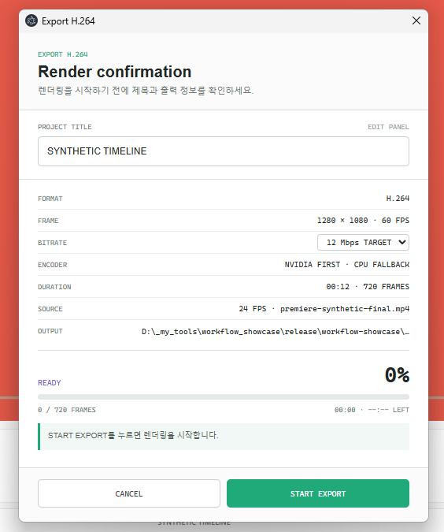

- 폴더 선택 미지원
- 현재 Beta UI의 출력은 1280 × 1080 / 60fps입니다. 24fps 원본 영상도 최종 출력은 60fps이며, UI `인터랙션`을 부드럽게 보여주기 위한 설정입니다.
- 비트레이트는 12 / 24 Mbps 중 선택할 수 있게 해놨습니다.
- NVIDIA 코덱 없으면 CPU 갈궈서 렌더하는데 얼마나 느릴지 모르겠습니다.

이후 결과물을 소셜/커뮤니티에 공유하세요!

---

# 입력값 설정

## 렌더링

렌더링 방식은 아래와 같습니다. ChatGPT 5.6 PRO 리뷰 내용에서 발췌했습니다.

#### 현재 렌더링 방식에 대한 판단

중간 손실 압축 파일을 먼저 만든 뒤 다시 인코딩하는 구조가 아니다.

현재 exporter는:

1. Electron offscreen window를 `1280 × 1080`으로 렌더링한다.
2. `paint` 이벤트에서 BGRA raw bitmap을 얻는다.
3. raw frame을 FFmpeg stdin으로 직접 전달한다.
4. 기본 `h264_nvenc`로 12 Mbps H.264를 생성한다.
5. NVENC가 없거나 실패하면 `libx264`로 전체 출력을 다시 시도한다.
6. `bt709`, `yuv420p`, `+faststart`를 적용한다.

따라서 UI 캔버스에는 **한 번의 최종 손실 인코딩**만 적용된다. 원본 영상 자체는 디코드 후 최종 합성본에 다시 인코딩되지만, 별도의 화면 녹화용 손실 파일을 거치지 않는다.

---

## 메뉴 설명 보충

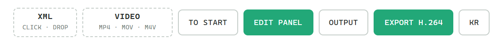

TO START: 처음(0초)으로 되돌아가는 버튼(Home 키와 동일)

EDIT PANEL: 사이드의 접힘 버튼과 동일

OUTPUT: 결과물 폴더 열기(폴더 지정 미구현)

EXPORT H.264: 렌더링

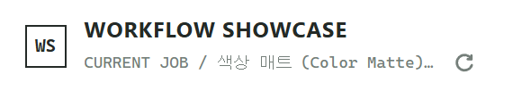

앱 우상단의 ↻ 버튼은 **Current Job 다시 불러오기**입니다. [보관 방법](#보관-방법) 참고.

EN/KR: UI 언어 전환

## 단축키

- Spacebar: 재생/일시정지
- Home/End: 처음/끝 Shot 이동
- 방향키: Shot 이동

---

## 콜아웃

타이틀 콜아웃은 최소한의 스타일만 제공합니다. 자신만의 개성있는 워터마크를 사용하셔도 좋습니다.

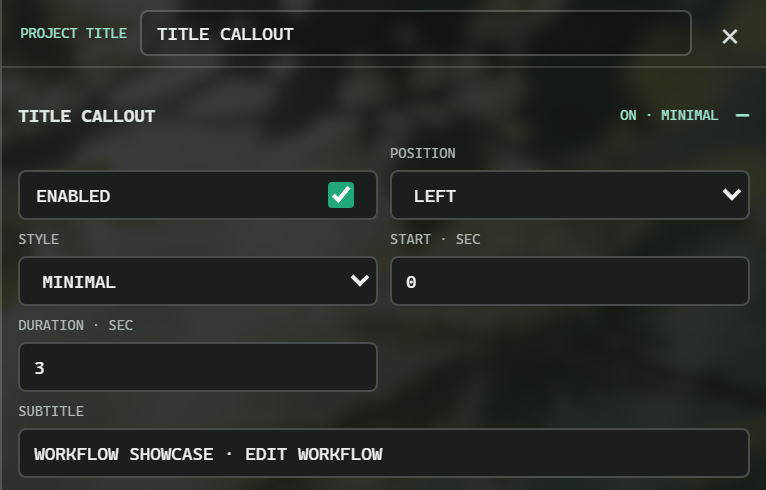

| LINE | LABEL | MINIMAL |
| :---: | :---: | :---: |
|  |  |  |


---

## 레퍼런스 세팅하는 방법

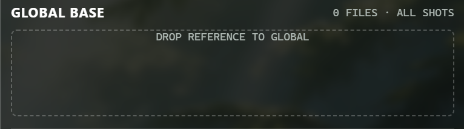

**GLOBAL BASE**: 이 곳에 등록된 레퍼런스는 모든 샷에 보여집니다. (전역 레퍼런스)

---

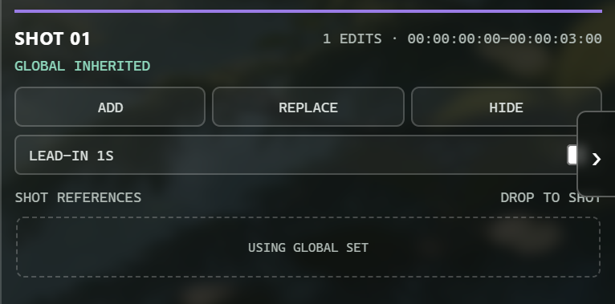

### SHOT ## 레퍼런스(해당 샷 재생 동안 보여줄 레퍼런스 교체하는 방법)

- ADD: GLOBAL BASE 옆에 추가되는 레퍼런스(기본값).
- REPLACE: 글로벌 무시하고 해당 레퍼런스만 보여줌.
- HIDE: 해당 샷에서 레퍼런스 숨김.
- LEAD-IN: 시간은 1초로 선택지 없습니다. 변경은 에이전트한테!

LEAD-IN는 레퍼런스 사용한 장면이 너무 짧아서 묻힐 때 1초 전부터 미리 인접 샷에 레퍼런스를 붙여 주는 기능입니다.

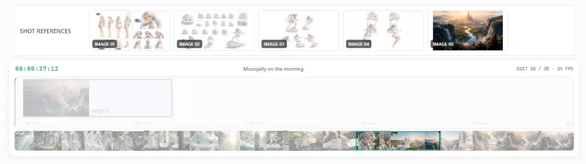

---

## 길이가 안 맞을 때 (DURATION Δ)

XML과 완성본 영상 길이가 1프레임 이상 다르면, 정지 상태에서 영상 왼쪽 위에 `DURATION Δ` 배지가 뜹니다.

특히 In/Out으로 뽑으면 XML에 Out의 1프레임까지 찍혀서 높은 확률로 뜹니다.

(무시해도 상관없어요. 재생 중과 실제 렌더링에선 안 보임)

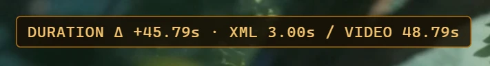

위 배지는 **XML에 등록된 끝은 45.79초인데 실제 비디오 길이는 48.79초다**를 알려 주는 거고 출력하면 실제로 **45.79초까지만 렌더링**됩니다. 해서 `영상은 10초에 끝났지만 1초의 여운을 남기고 싶다`면 색상 매트로 원하는 타임까지 잡고 XML로 내보내야 합니다.

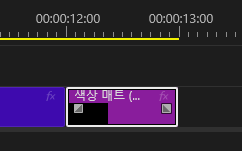

---

## 보관 방법

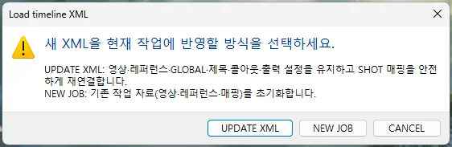

**UPDATE XML**은 샷이 추가되거나 길이가 짧아/길어졌다거나 하는 찐찐막.mp4 같은 업데이트가 필요할 때 사용합니다. 현재 세팅값을 유지하지만 새로 생긴 샷에 레퍼런스를 연결하는 건 별도입니다. XML뿐만 아니라 수정된 최종본도 교체해야 합니다.

**NEW JOB**은 작업이 끝나고 새로운 작업물로 갈아끼울 때 사용합니다.

현재 `current-job` 폴더 하나만 운영합니다. 별도의 마이그레이션 코드는 과하다 생각해 구현하지 않았습니다. 렌더링 된 최종결과물은 `current-job` 외부의 `output`에 별도 보관되고 유실되는 데이터는 **내가 샷별로 연결해놓은 레퍼런스 위치**뿐입니다. (노가다 다시 하는 정도)

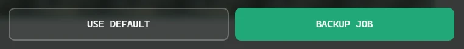

EDIT PANEL 하단에 작은 BACKUP JOB 버튼이 있습니다. 등록된 XML과 연결된 레퍼런스를 나중에라도 **재활용할지도 모르니 보존하고 싶다** 하면 이용하세요. 백업에는 원본 영상과 렌더링 결과물이 포함되지 않으며, 앱 안에서 바로 복원하는 기능도 제공하지 않습니다.

# 문제 해결

**Export 누르니 FFmpeg가 없다고 해요**
→ `winget install -e --id Gyan.FFmpeg` 실행하고 앱을 완전히 껐다 켜세요. winget이 안 되면 ffmpeg.exe를 앱 폴더 안의 `ffmpeg` 폴더에 넣어도 됩니다.

**영상을 넣었는데 거부돼요**
→ 앱이 재생 못 하는 코덱이면 기존 작업을 지키려고 교체 전에 막습니다. MP4(H.264)로 다시 뽑아서 넣어보세요.

**렌더링 결과가 예상보다 짧아요**
→ 위의 [DURATION Δ](#길이가-안-맞을-때-duration-δ) 항목 참고. XML 타임라인 길이만큼만 렌더링됩니다.

**앱을 켰는데 창이 안 떠요**
→ 이미 실행 중인 창이 있는지 보세요. 두 번째 실행은 기존 창을 앞으로 가져오고 조용히 종료됩니다(작업 데이터 보호용).

**뭔가 이상한데 원인을 모르겠어요**
→ `current-job/logs/app.log`에 전부 기록됩니다. 에이전트한테 [문제 해결 계약](./docs/TROUBLESHOOTING.md)을 따라 최근 이벤트 흐름부터 읽고, 코드를 고치기 전에 어디서 실패했는지 알려달라고 하세요.

---

# 마치며

- 지원 입력은 Final Cut Pro 7 XML(`xmeml`)이며 Adobe Premiere Pro에서 내보낸 XML도 포함됩니다. 최신 Final Cut Pro의 `.fcpxml`은 현재 지원하지 않으므로 [입력 어댑터 계약](./docs/INPUT_ADAPTER_CONTRACT.md)을 따르는 별도 어댑터가 필요합니다.
- 결과물 해상도는 `1280 x 1080`으로 핸드폰에서도 잘 보이는 정도는 됩니다.
- 저처럼 워크플로우를 따로 만들기는 귀찮고, 뭔가 한 티는 내보고 싶으신 분들이 가져가셔서 다양하게 활용해주셨으면 하는 바람이 있습니다. 본인 입맛대로 커스터마이징하기 좋게 신경 써놨으니 에이전트 갈궈서 맛있게 사용해 주세요.
- 코딩 관련 도메인 지식이 없어서 제일 좋은 모델 선택해서 바짓가랑이 잡고 **사용자가 [해줘] 한 번 치면 에이전트가 빠르게 그 부분만 찾아서 수정할 수 있게 해 달라**고 부탁했습니다. 공개 전 리팩토링하면서 안정적으로 유지할 코어와 자유롭게 바꿀 화면 영역을 분리해놨습니다. 수정하는 데 어려움은 없으리라 예상합니다.

---

해당 환경에서 테스트됐습니다.

- Windows 11
- Adobe Premiere 2026 (26.2.2 Build 3)

해당 환경에선 검증하지 못했습니다.

- macOS 앱 실행 환경은 검증하지 못했습니다.
- 최신 Final Cut Pro XML(`.fcpxml`)은 지원하지 않습니다. [입력 어댑터 계약](./docs/INPUT_ADAPTER_CONTRACT.md)에 따라 별도 어댑터를 만들어야 합니다. 에이전트한테 물어보심이..

해당 프로그램에선 안 됩니다.

- CapCut - 공식 타임라인 XML 내보내기 기능을 제공하지 않아 지원하지 않습니다.

설치하면 AI용 커스터마이즈 가이드 문서가 함께 들어갑니다. 뭘 바꾸고 싶다고 말하면 알아서 에이전트가 문서 통해서 빠르게 추적할 수 있게 해놨습니다. 지시만 하세요.
