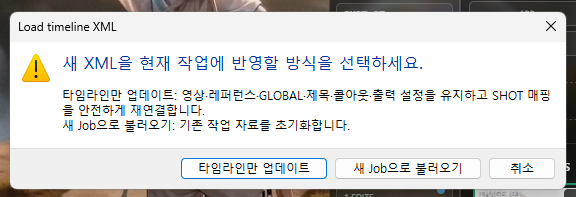

# Workflow Showcase

[한국어](./README.ko.md) · **English**

> `Workflow Showcase template` is a simple template app that uses XML data exported from Premiere to place a compact workflow presentation beneath your finished rendered video.

**Contents**: [Preview](#preview) · [Installation](#installation) · [How to use](#how-to-use) · [Output settings](#output-settings) · [Setting up references](#setting-up-references) · [Troubleshooting](#troubleshooting) · [Closing notes](#closing-notes)

# Preview

This is how the app works by default.


The area labeled CLIP A in the center is the user's actual finished video.

Below it, the references used during generation are connected directly to the work done in the editing tool.

---


By default, only the **topmost (PRIMARY) clip** among the `enabled clips` is imported.


You can also output it in a different style like this. Ask your agent to customize it however you like.


---

Here is an example made from the samples used during development.

Please focus on how the reference/clip interactions change.

The number of final SHOTS matches the number of original video clips used. Splitting one SHOT into multiple edits still counts as one SHOT, while the number of cuts appears as a small EDIT count at the top right of the timeline.


---

# Installation

The easiest method: give the URL below to an agent such as Codex or Claude and ask it to install the app.

```
https://github.com/ch5p/workflow-showcase
```

If you want to install it yourself, the requirements are:

- Windows 10 / 11
- Node.js 22.12 or later
- FFmpeg (required only for Export)
- NVIDIA GPU recommended (falls back to CPU when unavailable)

```
git clone https://github.com/ch5p/workflow-showcase
cd workflow-showcase

winget install -e --id Gyan.FFmpeg

npm.cmd ci
npm.cmd start
```

After that, double-click `START_APP.cmd` inside the folder whenever you want to launch the app.

On the first launch, you can play the sample Job. Load your own XML to replace it.

The app opens in Korean or English according to your Windows language. You can switch it with the `EN/KR` button in the header.

---

# How to use

Here is the basic workflow.


## 1. In Premiere, choose Export > Final Cut Pro XML... to export an XML file.

- WS does not currently support effect layers such as Adjustment Layers and automatically excludes them when importing XML. The default UI displays only actual video clips. Exposing effect layers as an `FX` lane requires a separate input adapter and UI implementation.

## 2. Launch the app, then add the XML and VIDEO files by drag-and-drop or by clicking their zones.

- Loading XML and VIDEO together is not currently supported. Add them separately.


It is easier to begin by adding references that should appear throughout the project to GLOBAL BASE. You can add references with the `ADD FILES` button as well as drag-and-drop.

## 3. Register individual references on each SHOT where the references should change.

More details are provided below.

## 4. Select EXPORT H.264 and render. That is it.


- Choosing a custom output folder is not supported.
- The current Beta UI outputs at 1280 × 1080 / 60 fps. A 24 fps source video is also exported at 60 fps so the UI `interactions` appear smooth.
- The bitrate can be set to 12 or 24 Mbps.
- If an NVIDIA encoder is unavailable, the app falls back to CPU rendering. I do not know how slow that may be on your system.

Share the result on social media or in your community.

---

# Output settings

## Rendering

The rendering process works as follows. This section is excerpted from a ChatGPT 5.6 PRO review.

#### Assessment of the current rendering method

The app does not first create an intermediate lossy-compressed file and then encode it again.

The current exporter:

1. Renders an Electron offscreen window at `1280 × 1080`.
2. Receives a BGRA raw bitmap from the `paint` event.
3. Sends each raw frame directly to FFmpeg through stdin.
4. Creates a 12 Mbps H.264 file with `h264_nvenc` by default.
5. Retries the entire output with `libx264` if NVENC is unavailable or fails.
6. Applies `bt709`, `yuv420p`, and `+faststart`.

Therefore, the UI canvas receives **only one final lossy encode**. The source video itself is decoded and re-encoded into the final composite, but it does not pass through a separate lossy screen-recording file.

---

## Additional menu notes


TO START: Return to the beginning (0 seconds), identical to the Home key

EDIT PANEL: Identical to the collapsible side button

OUTPUT: Open the output folder (custom folder selection is not implemented)

EXPORT H.264: Render the output


The ↻ button at the top right of the app is **Reload Current Job**. See [Storage and backup](#storage-and-backup).

EN/KR: Switch the UI language

## Keyboard shortcuts

- Spacebar: Play/pause
- Home/End: Move to the first/last SHOT
- Arrow keys: Move between SHOTS

---

## Callout

The title callout provides only minimal styles. You can also use your own distinctive watermark.


| LINE | LABEL | MINIMAL |
| :---: | :---: | :---: |
|  |  |  |


---

## Setting up references


**GLOBAL BASE**: References registered here appear in every SHOT. (Global references)

---


### SHOT ## references (how to replace references while that SHOT is playing)

- ADD: Add these references beside GLOBAL BASE (default).
- REPLACE: Ignore GLOBAL BASE and show only these references.
- HIDE: Hide references during this SHOT.
- LEAD-IN: Fixed at 1 second with no built-in option. Ask your agent if you want to change it.

LEAD-IN places a reference on the neighboring SHOT one second early when the scene using that reference is too short to register clearly.


---

## When the durations do not match (DURATION Δ)

If the XML and finished video differ in length by at least one frame, a `DURATION Δ` badge appears at the top left of the paused video.

This is especially likely after an In/Out export because the XML may include the final Out frame.

(You can ignore it. It does not appear during playback or in the rendered output.)


The badge above means that **the XML endpoint is 45.79 seconds while the actual video is 48.79 seconds**. The exported result will stop at **45.79 seconds**, following the XML. If your `video ends at 10 seconds but you want to leave one second of breathing room`, extend the timeline to the desired endpoint with a Color Matte before exporting the XML.


---

## Storage and backup



This dialog appears when an XML already exists and you load another XML.

Use **UPDATE XML** when the finished video has gained a SHOT, a SHOT has become shorter or longer, or you need another final_final_really-final.mp4-style update. It preserves the video, references, GLOBAL, title, callout, and output settings, then safely reconnects existing SHOT mappings to the new timeline.

Use **NEW JOB** after finishing one project and moving on to a different one. It resets the existing XML, video, references, mappings, title, and callout, but preserves rendered Export files, logs, UI language, and output settings.

**CANCEL** closes the dialog without changing anything.

The app operates a single `current-job` folder. New information replaces the current work and is not automatically stored in a separate Job slot.


A small BACKUP JOB button appears at the bottom of the EDIT PANEL. It copies `job.json`, the registered XML, references, and hash information to the `backup` folder. Source video, Export files, and logs are not included, so keep the MP4 used by the Job separately for restoration. You can also quit the app completely and preserve a copy of the entire `current-job` folder.

# Troubleshooting

**Export says FFmpeg is missing**
→ Run `winget install -e --id Gyan.FFmpeg`, then completely quit and reopen the app. If WinGet is unavailable, place `ffmpeg.exe` in the app folder's `ffmpeg` directory.

**My video is rejected when I add it**
→ If the app cannot play its codec, it blocks the replacement before changing the existing Job. Export it again as MP4 (H.264) and try loading that file.

**The rendered result is shorter than expected**
→ See [DURATION Δ](#when-the-durations-do-not-match-duration-δ) above. The app renders only the XML timeline duration.

**I launched the app, but no window appeared**
→ Check whether another instance is already running. A second launch brings the existing window forward and then exits quietly to protect the Job data.

**Something is wrong, but I do not know why**
→ Everything is recorded in `current-job/logs/app.log`. The fastest option is to ask an agent, “Read this log and tell me what is wrong.”

---

# Closing notes

- The supported input is Final Cut Pro 7 XML (`xmeml`), including XML exported from Adobe Premiere Pro. Modern Final Cut Pro `.fcpxml` is not currently supported and requires a separate input adapter.
- The output resolution is `1280 x 1080`, which is reasonably viewable on a phone.
- I hope people who, like me, cannot be bothered to build an entire workflow presentation but still want to show that some work went into the process will take this and use it in different ways. I paid attention to making it easy to customize, so put your agent to work and tailor it to your taste.
- I do not have a programming background, so I picked the strongest model I could and asked it to make sure that **when a user types [do it] once, an agent can quickly locate and modify only that part**. During the public-release refactor, the stable core was separated from the presentation areas intended for free customization. I expect modifications to be approachable.

---

Tested in the following environment:

- Windows 11
- Adobe Premiere 2026 (26.2.2 Build 3)

Not validated in the following environment:

- The app has not been validated on macOS.
- Modern Final Cut Pro XML (`.fcpxml`) is not supported. A separate input adapter must be created. Ask your agent if needed.

This program does not work with:

- CapCut — it does not provide an official timeline XML export, so it is not supported.

The installation includes AI customization guides. Tell your agent what you want to change, and the documents are organized so it can trace the relevant area quickly. Just give the instruction.
